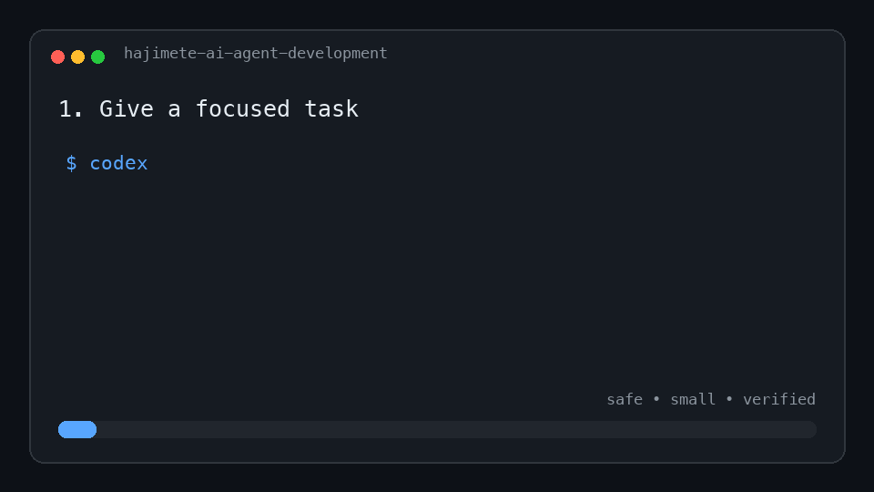

# はじめてのAIエージェント開発

[日本語](./README.md) | [English](./README.en.md)

> **10分で始める、CodexとAGENTS.mdによる安全で実践的なAIエージェント開発**

AIに全部任せるためではなく、AIと安心して一緒に作るための、小さな実践ガイドです。

**10分で、問い合わせを分類して返信案を作る小さなAIエージェントを動かし、AIエージェント開発の基本を学べます。**

このガイドでは、Codexなどの「AIコーディングエージェント」を使って、小さな「AIエージェント」を作る方法を学びます。難しい設定や専門知識は必要ありません。



## 10分の流れ

| 時間 | やること |
| --- | --- |
| 1分 | リポジトリを取得する |
| 2分 | サンプルを実行する |
| 2分 | テストを実行する |
| 3分 | `AGENTS.md` をコピーして3か所直す |
| 2分 | 最初の小さな依頼を試して確認する |

## まず5分で動かす

APIキーも外部ライブラリも不要です。すべてローカルで動作します。問い合わせを分類し、安全な返信案を作るミニエージェントを動かしてみましょう。

これは生成AIモデルを使わず、安全な制御ループを学ぶための決定的なローカル版です。

### 1. リポジトリを取得する（1分）

このリポジトリのGitHubページ右上にある緑色の「Code」ボタンを押し、「HTTPS」のURLをコピーします。`git clone` は、そのURLにあるファイル一式を自分のパソコンへコピーするコマンドです。

```bash
git clone https://github.com/daisukewatanabejapan/hajimete-ai-agent-development.git
cd hajimete-ai-agent-development
```

`git: command not found` と表示された場合は、[Git公式サイト](https://git-scm.com/downloads)からGitをインストールしてください。

### 2. Python 3を確認して実行する（2分）

```bash
python3 --version
cd examples/five-minute-agent
python3 agent.py
```

`Python 3.9` 以上が表示されれば準備完了です。`python3: command not found` と表示された場合は、[Python公式サイト](https://www.python.org/downloads/)からPython 3をインストールしてください。

Windowsで `python3` が見つからない場合は、以降のコマンドを `python` に読み替えてください。

```powershell
python --version
python agent.py
```

成功すると、次のような分類結果と返信案が表示されます。

```json
{
  "category": "bug",
  "summary": "保存ボタンを押しても反応しません",
  "reply_draft": "ご報告ありがとうございます。発生した環境と再現手順を教えてください。",
  "needs_human_review": true
}
```

### 3. テストする（2分）

```bash
python3 -m unittest -v
```

Windowsでは `python -m unittest -v` を実行します。

`OK` と表示されれば成功です。**ここまでで5分です。ここからさらに5分で、自分のプロジェクトに `AGENTS.md` を追加します。**

詳しい説明は [5分で動くAIエージェント](./examples/five-minute-agent/README.md) にあります。

## こんな人におすすめ

- AIコーディングエージェントを初めて使う
- AIにコード修正を頼んだら、想像以上に変更されて困った
- `AGENTS.md` に何を書けばよいか分からない
- 個人開発や小さなチームでAIを安全に活用したい

## ここからさらに5分：`AGENTS.md`を追加する

### 4. `AGENTS.md` をコピーする（3分）

このリポジトリの [`AGENTS.md`](./AGENTS.md) を、自分のリポジトリの一番上にコピーします。

#### 3か所だけ書き換える

コピーしたファイルの次の項目を、自分のプロジェクトに合わせます。

1. このプロジェクトについて
2. テストコマンド
3. 変更してはいけないもの

まだテストがない場合は、無理にコマンドを作らず「テストはまだありません」と書いて構いません。

### 5. 小さな仕事を頼む（2分）

最初は、READMEの1文字だけを直すなど、結果を自分で確認できる小さな仕事がおすすめです。

```text
目的：
READMEの見出しにある「始めて」を「初めて」に1文字だけ直してください。

変更範囲：
README.mdだけを変更してください。

完了条件：
指定した1文字だけが直り、ほかの文章が変わっていないこと。

注意：
構成やデザインは変更しないでください。
```

#### 結果を確認する

AIの「完了しました」だけで判断せず、最低限次を確認します。

- 変更されたファイルは想定どおりか
- 関係のない変更が入っていないか
- テストは成功したか
- パスワードやトークンが書かれていないか

## 覚えるのは4項目だけ

AIへの依頼には、次の4項目があると伝わりやすくなります。

| 項目 | 書くこと |
| --- | --- |
| 目的 | 何を実現したいか |
| 変更範囲 | どこまで触ってよいか |
| 完了条件 | 何を確認できたら完成か |
| 注意 | 変えてはいけないこと |

コピー用のひな型は [`examples/REQUEST_TEMPLATE.md`](./examples/REQUEST_TEMPLATE.md) にあります。

## もう少し学びたい人へ

最初の依頼を試したら、次の3章へ進んでみてください。順番に読んでも、気になる章だけ読んでも構いません。

1. [AIエージェント開発の小さなサンプル](./docs/01-agent-sample.md)
2. [プロンプト設計の実例](./docs/02-prompt-design.md)
3. [システム設計の考え方](./docs/03-system-design.md)

この3章では、特定のモデルやフレームワークに依存しない基本を扱います。APIキーは必要ありません。

### 実践ガイド

4. [AIエージェント開発の設計パターン集](./docs/04-design-patterns.md)
5. [実際の失敗例と改善例（Before / After）](./docs/05-failures-before-after.md)
6. [プロジェクト規模ごとのAGENTS.mdテンプレート](./docs/06-agents-by-project-size.md)
7. [チーム開発での運用例](./docs/07-team-workflow.md)
8. [AIへの依頼文（プロンプト）のカタログ](./docs/08-prompt-catalog.md)

### 見て確認する

9. [AIエージェント全体像のアーキテクチャ図](./docs/09-architecture.md)
10. [FAQ：初心者がつまずく点](./docs/10-faq.md)
11. [AIエージェント開発チェックリスト](./docs/11-checklist.md)
12. [OSS Showcase：実際のAGENTS.md事例](./docs/12-showcase.md)

## `AGENTS.md` とは

`AGENTS.md` は、AIエージェントにプロジェクトの決まりを伝えるファイルです。プロジェクトの説明、よく使うコマンド、テスト方法、変更時の注意などを書きます。

毎回の依頼に同じ説明を書く代わりに、長く使うルールをここへ置きます。一度だけのお願いは、依頼文に書きます。

用途別の例も用意しています。

- [`AGENTS-minimal.md`](./examples/AGENTS-minimal.md)：最小構成
- [`AGENTS-java.md`](./examples/AGENTS-java.md)：Java向け
- [`AGENTS-go.md`](./examples/AGENTS-go.md)：Go向け
- [`AGENTS-rust.md`](./examples/AGENTS-rust.md)：Rust向け
- [`AGENTS-javascript.md`](./examples/AGENTS-javascript.md)：JavaScript向け
- [`AGENTS-python.md`](./examples/AGENTS-python.md)：Python向け
- [`AGENTS-node.md`](./examples/AGENTS-node.md)：Node.js向け（既存例）

詳しい仕様はOpenAI公式の [AGENTS.mdガイド](https://developers.openai.com/codex/guides/agents-md) を確認してください。

## 大きな作業では計画を作る

複数のファイルを変える仕事や、途中で判断が必要な仕事では、実装前に短い計画を作ると安全です。このリポジトリでは [`PLANS.md`](./PLANS.md) を計画のひな型として用意しています。

`PLANS.md` はCodexの必須設定ファイルではありません。このガイド独自の、作業を整理するためのひな型です。

## 安全のための5つの約束

1. 最初は小さな仕事を頼む
2. 変更範囲と完了条件を書く
3. 削除や公開など、元に戻しにくい操作は自分で確認する
4. APIキー、パスワード、個人情報を入力しない
5. 最後は人が差分とテスト結果を確認する

## `config.toml` は必要？

最初は必要ありません。

`AGENTS.md` は「このプロジェクトでどう仕事をするか」を伝えるものです。一方、`.codex/config.toml` はCodex自体の設定です。モデル、承認、サンドボックス、MCPなどを調整したくなってから学べば十分です。

設定するときは、古いサンプルをそのままコピーせず、OpenAI公式の [`config.toml`リファレンス](https://developers.openai.com/codex/config-reference) で現在の設定項目を確認してください。

## よくある失敗

### 「いい感じに直して」と頼む

範囲も完成の基準も分からないため、変更が大きくなりがちです。

```text
ログイン画面のエラー文を、初心者にも分かる表現にしてください。
ログイン画面とそのテストだけを変更し、認証処理は変更しないでください。
```

### テスト方法を書かない

AIが正しい検証方法を推測できるとは限りません。`AGENTS.md` に、実際に動くコマンドを書きます。

### 一度に全部頼む

調査、実装、リファクタリング、ドキュメント更新を一度に頼むと確認が難しくなります。小さな完了単位に分けます。

## このガイドの範囲

このガイドは、CodexなどのAIコーディングエージェントとの開発を入口に、簡単なAIエージェントを設計する基本までを扱います。独自のAIモデルを学習させる教材ではありません。

## オープンソースとして公開しています

- [MIT License](./LICENSE) で自由に利用・変更できます
- [Issue](https://github.com/daisukewatanabejapan/hajimete-ai-agent-development/issues) で質問や改善提案を歓迎します
- [Pull Request](https://github.com/daisukewatanabejapan/hajimete-ai-agent-development/pulls) で修正やサンプル追加を歓迎します

## コントリビューション

誤りの報告、分かりにくい表現の改善、初心者向けサンプルの追加を歓迎します。手順は [`CONTRIBUTING.md`](./CONTRIBUTING.md) をご覧ください。

## ライセンス

[MIT License](./LICENSE) で公開しています。自分のプロジェクトに合わせて自由にコピー、変更できます。

ここまで終われば、AIエージェント開発の基本的な流れを一通り体験できています。
