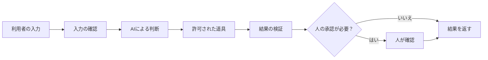

# システム設計の考え方

AIエージェントの設計では、モデル選びより先に「どこまで自動化し、どこで人が確認するか」を決めます。

## 最小の構成



初心者は、まず次の5つに分ければ十分です。

1. 入力
2. AIの判断
3. 道具
4. 検証
5. 人の承認

## 1. 入力

何を受け取るかを決めます。

- 利用者が入力した文章
- アップロードされたファイル
- データベースから取得した情報
- 道具が返した検索結果

外部から届く内容は、正しいとは限りません。文字数、ファイル形式、必須項目などをAIへ渡す前に確認します。

## 2. AIの判断

AIに任せる判断を小さくします。

問い合わせの例なら、「自由に対応する」ではなく次のように分けます。

- 分類する
- 要約する
- 返信案を作る

それぞれの入力と出力を決めると、どこで失敗したか分かりやすくなります。

## 3. 道具

AIは、必要な操作だけを行えるようにします。

```text
FAQを検索する       → 許可
FAQを書き換える     → 許可しない
返信案を保存する     → 許可
顧客へメール送信する → 人の承認が必要
```

読み取りと書き込みを分け、削除、送信、購入、公開など元に戻しにくい操作には承認を入れます。

## 4. 検証

AIの出力をそのまま次の処理へ渡さず、プログラムでも確認します。

- 必須項目がそろっているか
- 分類が許可された値か
- 文字数が上限以内か
- 個人情報が含まれていないか
- 根拠となる情報があるか

AIに「確認してください」と頼むだけでなく、機械的に判定できるものは通常のコードで検証します。

## 5. 人の承認

最初は、人の確認を多めにします。

| 操作 | 最初のおすすめ |
| --- | --- |
| 分類結果を表示 | 自動でよい |
| 返信案を作る | 自動でよい |
| データを更新 | 人が確認する |
| メールを送る | 人が確認する |
| ファイルを削除 | 人が確認する |
| 外部へ公開する | 人が確認する |

運用実績とテストが増えてから、危険の小さい部分だけ承認を減らします。

## 状態と記録

後から調査できるように、次を記録します。

- いつ実行したか
- どんな入力を受け取ったか
- どの道具を使ったか
- どんな結果になったか
- 人が承認または却下したか
- エラーが起きたか

ただし、パスワード、APIキー、不要な個人情報はログへ残しません。

## 失敗したときの設計

正常時だけでなく、失敗時の動作を先に決めます。

```text
情報が足りない       → 利用者へ確認する
分類できない         → otherとして人へ渡す
道具が失敗した       → 勝手に成功扱いしない
出力形式が壊れた     → 再試行するか人へ渡す
危険な操作が必要     → 実行せず承認を求める
```

## 小さく育てる順番

```text
レベル1：AIが案を作り、人がすべて確認する
    ↓
レベル2：検索など、読み取り専用の道具を追加する
    ↓
レベル3：出力検証とテストを増やす
    ↓
レベル4：安全な処理だけ自動実行する
    ↓
レベル5：監視しながら対象範囲を広げる
```

最初から完全自動を目指す必要はありません。「失敗しても被害が小さく、人が気づける設計」から始めるのが大切です。

## 設計チェックリスト

- [ ] エージェントの目的を1文で説明できる
- [ ] 入力と出力の形が決まっている
- [ ] AIに任せる判断が限定されている
- [ ] 道具の権限が必要最小限になっている
- [ ] 元に戻しにくい操作に人の承認がある
- [ ] 出力を通常のコードでも検証している
- [ ] 失敗時の動作が決まっている
- [ ] テストケースと実行記録が残る
