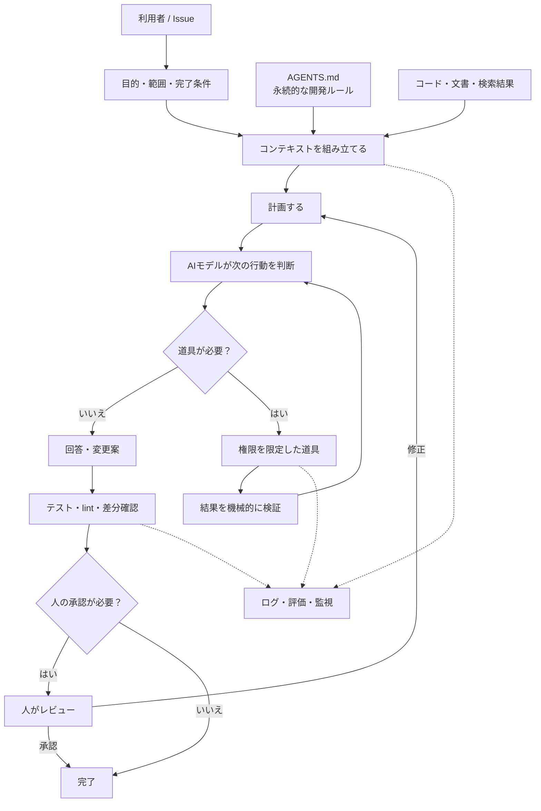

# AIエージェント全体像のアーキテクチャ図

AIエージェントは、AIモデルだけではありません。指示、入力、道具、検証、人の承認、記録を組み合わせたシステムです。

## それぞれの役割

| 要素 | 役割 |
| --- | --- |
| 依頼文 | 今回だけの目的、範囲、完了条件 |
| `AGENTS.md` | リポジトリで長く使う規約とコマンド |
| コンテキスト | AIが判断に使うコード、文書、検索結果 |
| AIモデル | 次の行動や回答を判断する |
| 道具 | 検索、テスト、ファイル変更などを実行する |
| 検証 | 形式、テスト、lint、差分を確認する |
| 人の承認 | 送信、公開、削除などの境界を守る |
| ログ・評価 | 後から失敗を調べ、改善する |

## 最初に作る範囲

初心者は、`依頼文 → AIが案を作る → テスト → 人が確認` までで十分です。外部送信や自動更新は、テストと運用記録が増えてから追加します。
