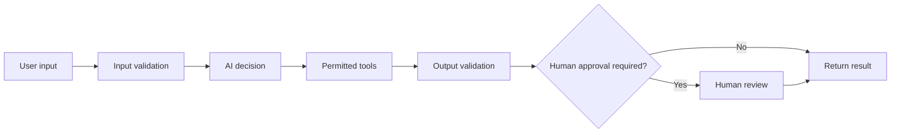

# How to Think About System Design

Before choosing a model, decide what should be automated and where a person must review the work.

## The smallest useful architecture



For a first design, think in five parts:

1. Input
2. AI decision
3. Tools
4. Validation
5. Human approval

## 1. Input

Define what the system accepts: user text, uploaded files, database records, or tool results. External input may be incorrect or hostile. Validate length, file type, and required fields before sending it to AI.

## 2. AI decision

Keep each decision small. Instead of “handle the request,” separate classification, summarization, and reply drafting. Clear inputs and outputs make failures easier to locate.

## 3. Tools

Allow only the operations that are needed.

```text
Search the FAQ       → allow
Edit the FAQ         → do not allow
Save a reply draft   → allow
Send an email        → require approval
```

Separate reading from writing. Require approval for deleting, sending, purchasing, publishing, and other hard-to-reverse actions.

## 4. Validation

Do not pass AI output directly to the next system. Check it with ordinary code where possible:

- Are all required fields present?
- Is the category one of the allowed values?
- Is the text within its length limit?
- Does it contain personal data?
- Is supporting evidence available?

## 5. Human approval

Begin with more human review and reduce it only after you have tests and operational evidence.

| Action | Beginner recommendation |
| --- | --- |
| Display a classification | Automatic is reasonable |
| Create a reply draft | Automatic is reasonable |
| Update data | Human review |
| Send email | Human review |
| Delete a file | Human review |
| Publish externally | Human review |

## State and records

Record when the run happened, what input was received, which tools were used, the result, approval decisions, and errors. Never log passwords, API keys, or unnecessary personal data.

## Design for failure

```text
Missing information  → ask the user
Cannot classify      → use other and send to a person
Tool fails           → do not report success
Invalid output       → retry safely or send to a person
Risky action needed  → stop and request approval
```

## Grow in small steps

```text
Level 1: AI drafts; a person reviews everything
    ↓
Level 2: Add read-only tools such as search
    ↓
Level 3: Add output validation and tests
    ↓
Level 4: Automate only low-risk actions
    ↓
Level 5: Expand carefully with monitoring
```

Do not aim for full autonomy first. Start with a system where failures have limited impact and are visible to a person.

## Design checklist

- [ ] The goal fits in one sentence
- [ ] Input and output shapes are defined
- [ ] AI decisions are limited and testable
- [ ] Tool permissions are minimal
- [ ] Hard-to-reverse actions require approval
- [ ] Ordinary code validates the output
- [ ] Failure behavior is defined
- [ ] Test cases and run records are retained
