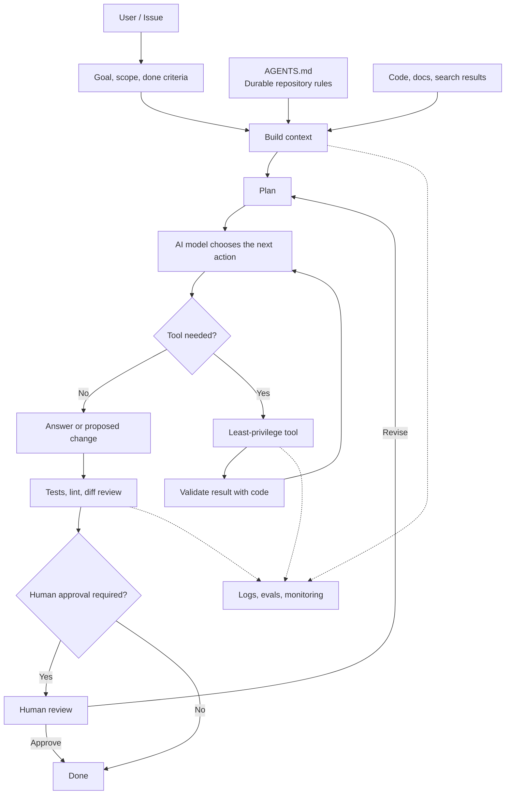

# AI Agent Architecture at a Glance

An AI agent is not just a model. It combines instructions, input, tools, validation, human approval, and operational records.

| Element | Responsibility |
| --- | --- |
| Task prompt | One-time goal, scope, and completion criteria |
| `AGENTS.md` | Durable repository conventions and commands |
| Context | Code, documents, and results used for decisions |
| AI model | Chooses an answer or next action |
| Tools | Search, test, and modify files |
| Validation | Check formats, tests, lint, and diffs |
| Human approval | Protect sending, publishing, deletion, and other boundaries |
| Logs and evals | Investigate failures and improve the system |

For a first version, stop at `task → AI draft → tests → human review`. Add external sending and automatic updates only after you have tests and operational evidence.
